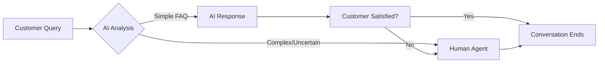

<div align="center">

# 🤖💬 AI Customer Service

### *Bridging the Gap Between AI and Human Touch for Indian MSMEs*

[](https://github.com)
[](https://github.com)
[](LICENSE)

*Empowering small businesses with intelligent, affordable, and culturally-aware customer support*

[Features](#-features) • [Why This Exists](#-the-problem) • [How It Works](#-how-it-works) • [Tech Stack](#-tech-stack) • [Roadmap](#-roadmap) • [Getting Started](#-getting-started)

---

</div>

## 🎯 Overview

**AI Customer Service** is a hybrid support system designed specifically for Indian Micro, Small, and Medium Enterprises (MSMEs). It combines the efficiency of AI with the empathy of human agents, ensuring no customer query goes unanswered—even at 2 AM.

Whether you run a **local shop**, **clinic**, **salon**, **coaching center**, or any **service-based business**, this system helps you:
- ✅ **Never miss a customer inquiry**
- ✅ **Provide 24/7 support** without hiring a call center
- ✅ **Communicate naturally in Hindi/Hinglish**
- ✅ **Automatically escalate** complex issues to humans
- ✅ **Keep costs affordable** for small businesses

---

## 💡 The Problem

### What Indian Small Businesses Face Today

| Challenge | Impact |
|-----------|--------|
| 📞 **Missed Calls** | Lost customers, damaged reputation |
| ⏰ **No 24/7 Support** | Customers go to competitors |
| 🌐 **Language Barriers** | Miscommunication, frustration |
| 💰 **Expensive Call Centers** | Unaffordable for MSMEs |
| 📱 **Unorganized Messages** | Important queries get buried |

### The Solution We're Building

A **smart, affordable, and culturally-aware** customer service system that:
- 🤖 Handles common queries automatically using AI
- 🗣️ Understands and responds in **Hindi/Hinglish** naturally
- 👤 Seamlessly hands over to humans when needed
- 💵 Costs a fraction of traditional call centers
- 📊 Keeps everything organized and trackable

---

## ✨ Features

### Current (Prototype Phase)
- 🏗️ **Early-stage development** - Building core infrastructure
- 📝 **Public development** - Transparent progress tracking
- 🚀 **Mock AI Engine** - Simulates intelligent responses
- 💬 **Hybrid Support** - Basic fallback logic implemented

### Planned Features

#### 🎨 **For Businesses**
- **Simple Dashboard** - Manage FAQs, view conversations, track metrics
- **Custom Branding** - Add your business logo and colors
- **Multi-channel Support** - WhatsApp, Website Chat, SMS integration
- **Analytics** - Understand customer queries and satisfaction

#### 💬 **For Customers**
- **Natural Conversations** - Chat in Hindi/Hinglish like talking to a friend
- **Instant Responses** - Get answers to common questions immediately
- **Human Handoff** - Easy "Talk to Human" option when needed
- **24/7 Availability** - Support anytime, anywhere

#### 🤖 **AI Capabilities**
- **FAQ-Based Responses** - Learn from your business FAQs
- **Context Awareness** - Remembers conversation history
- **Smart Escalation** - Knows when to involve humans
- **Multi-language Support** - Hindi, Hinglish, English

---

## 🔄 How It Works



### The Flow

1. **Customer sends a message** (via website chat, WhatsApp, etc.)
2. **AI analyzes the query** using FAQ database and context
3. **Two paths:**
   - ✅ **Simple query** → AI responds immediately
   - ❓ **Complex/uncertain** → Escalates to human agent
4. **Human agent takes over** seamlessly (if needed)
5. **Conversation tracked** for analytics and improvement

---

## 🛠️ Tech Stack

### Frontend
- **React (Vite)** - Modern, fast UI framework
- **Tailwind CSS** - Utility-first styling with "Velora" design system
- **Framer Motion** - Smooth interfaces and animations
- **Lucide React** - Beautiful, consistent icons

### Backend
- **Node.js** - Runtime environment
- **Express.js** - Web framework
- **MongoDB** - Database for conversations and FAQs (with In-Memory Fallback)

### AI & APIs
- **OpenAI GPT** or **Google Gemini** - Natural language processing (Planned)
- **Custom FAQ Engine** - Business-specific knowledge base

### Deployment
- **Netlify/Vercel** - Frontend hosting
- **Render/Railway** - Backend hosting

---

## 🗺️ Roadmap

### Phase 1: Foundation 🏗️
- [x] Project setup and architecture
- [x] React Frontend with "Velora" UI
- [x] Backend API with Mock Data support
- [x] Basic Chat Interface

### Phase 2: Core Features ⚙️
- [ ] FAQ management system
- [ ] Real AI integration (OpenAI/Gemini)
- [ ] Hindi/Hinglish language fine-tuning
- [ ] Persistent Database connection

### Phase 3: Human Handoff 👤
- [ ] Agent dashboard
- [ ] Real-time Socket.io integration
- [ ] Notification system

### Phase 4: Polish & Deploy 🚀
- [ ] UI/UX improvements
- [ ] Performance optimization
- [ ] Production deployment

### Phase 5: Real-World Testing 🧪
- [ ] Demo with local business
- [ ] User feedback collection

---

## 🚀 Getting Started

### Prerequisites

- Node.js (v16 or higher)
- MongoDB (optional, app runs in Mock Mode without it)

### Installation

```bash
# Clone the repository
git clone https://github.com/yourusername/ai-customer-service.git

# Navigate to project directory
cd ai-customer-service

# --- Backend Setup ---
cd backend
npm install
npm start
# Server runs on http://localhost:5000

# --- Frontend Setup ---
# Open a new terminal
cd frontend
npm install
npm run dev
# App runs on http://localhost:5173
```

---

## 📁 Project Structure

```
ai-customer-service/
│
├── frontend/              # React Frontend
│   ├── src/
│   │   ├── components/   # Reusable UI components
│   │   ├── pages/        # Main application pages
│   │   ├── assets/       # Static assets
│   │   └── App.jsx       # Main application entry
│   ├── vite.config.js    # Vite configuration
│   └── tailwind.config.js # Tailwind configuration
│
├── backend/               # Express Backend
│   ├── server.js         # Entry point
│   ├── routes/           # API routes
│   ├── models/           # Mongoose models
│   ├── services/         # Business logic
│   └── config/           # Database config
│
├── frontend_legacy/       # Archived Vanilla JS Frontend
└── README.md             # Project Documentation
```

---

## 🤝 Contributing

We're building this **in public** and welcome contributions! 🎉

### How to Contribute

1. **Fork the repository**
2. **Create a feature branch** (`git checkout -b feature/amazing-feature`)
3. **Make your changes**
4. **Commit with clear messages** (`git commit -m 'Add amazing feature'`)
5. **Push to your branch** (`git push origin feature/amazing-feature`)
6. **Open a Pull Request**

---

<div align="center">

### ⚠️ **Early Prototype Warning**

This is an **experimental project** in active development.  
Features may change, bugs may exist, and everything will evolve based on real-world feedback.

**We're building this in public. Join us! 🚀**

---

Made with ❤️ for Indian Small Businesses

[⬆ Back to Top](#-ai-customer-service)

</div>
