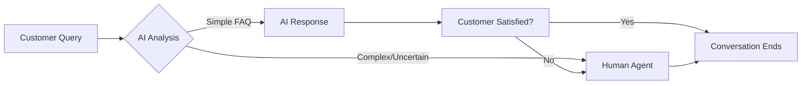

<div align="center">

# 🤖💬 AI Customer Service

### *Bridging the Gap Between AI and Human Touch for Indian MSMEs*

[](https://github.com)
[](https://github.com)
[](LICENSE)

*Empowering small businesses with intelligent, affordable, and culturally-aware customer support*

[Features](#-features) • [Why This Exists](#-the-problem) • [How It Works](#-how-it-works) • [Tech Stack](#-tech-stack) • [Roadmap](#-roadmap) • [Getting Started](#-getting-started)

---

</div>

## 🎯 Overview

**AI Customer Service** is a hybrid support system designed specifically for Indian Micro, Small, and Medium Enterprises (MSMEs). It combines the efficiency of AI with the empathy of human agents, ensuring no customer query goes unanswered—even at 2 AM.

Whether you run a **local shop**, **clinic**, **salon**, **coaching center**, or any **service-based business**, this system helps you:
- ✅ Never miss a customer inquiry
- ✅ Provide 24/7 support without hiring a call center
- ✅ Communicate naturally in Hindi/Hinglish
- ✅ Automatically escalate complex issues to humans
- ✅ Keep costs affordable for small businesses

---

## 💡 The Problem

### What Indian Small Businesses Face Today

| Challenge | Impact |
|-----------|--------|
| 📞 **Missed Calls** | Lost customers, damaged reputation |
| ⏰ **No 24/7 Support** | Customers go to competitors |
| 🌐 **Language Barriers** | Miscommunication, frustration |
| 💰 **Expensive Call Centers** | Unaffordable for MSMEs |
| 📱 **Unorganized Messages** | Important queries get buried |

### The Solution We're Building

A **smart, affordable, and culturally-aware** customer service system that:
- 🤖 Handles common queries automatically using AI
- 🗣️ Understands and responds in Hindi/Hinglish naturally
- 👤 Seamlessly hands over to humans when needed
- 💵 Costs a fraction of traditional call centers
- 📊 Keeps everything organized and trackable

---

## ✨ Features

### Current (Prototype Phase)
- 🏗️ **Early-stage development** - Building core infrastructure
- 📝 **Public development** - Transparent progress tracking

### Planned Features

#### 🎨 **For Businesses**
- **Simple Dashboard** - Manage FAQs, view conversations, track metrics
- **Custom Branding** - Add your business logo and colors
- **Multi-channel Support** - WhatsApp, Website Chat, SMS integration
- **Analytics** - Understand customer queries and satisfaction

#### 💬 **For Customers**
- **Natural Conversations** - Chat in Hindi/Hinglish like talking to a friend
- **Instant Responses** - Get answers to common questions immediately
- **Human Handoff** - Easy "Talk to Human" option when needed
- **24/7 Availability** - Support anytime, anywhere

#### 🤖 **AI Capabilities**
- **FAQ-Based Responses** - Learn from your business FAQs
- **Context Awareness** - Remembers conversation history
- **Smart Escalation** - Knows when to involve humans
- **Multi-language Support** - Hindi, Hinglish, English

---

## 🔄 How It Works



### The Flow

1. **Customer sends a message** (via website chat, WhatsApp, etc.)
2. **AI analyzes the query** using FAQ database and context
3. **Two paths:**
   - ✅ **Simple query** → AI responds immediately
   - ❓ **Complex/uncertain** → Escalates to human agent
4. **Human agent takes over** seamlessly (if needed)
5. **Conversation tracked** for analytics and improvement

---

## 🛠️ Tech Stack

### Frontend
- **HTML5** - Semantic markup
- **CSS3** - Modern styling with animations
- **Vanilla JavaScript** - Lightweight, no framework overhead

### Backend
- **Node.js** - Runtime environment
- **Express.js** - Web framework
- **MongoDB** - Database for conversations and FAQs

### AI & APIs
- **OpenAI GPT** or **Google Gemini** - Natural language processing
- **Custom FAQ Engine** - Business-specific knowledge base

### Deployment
- **Netlify** - Frontend hosting (static site)
- **Render/Railway** - Backend hosting (Node.js server)

### Future Integrations
- 📱 WhatsApp Business API
- 📧 Email support
- 📊 Analytics dashboard
- 🔔 Notification system

---

## 🗺️ Roadmap

### Phase 1: Foundation 🏗️
- [x] Project setup and planning
- [ ] Basic landing page
- [ ] Simple chat UI
- [ ] Backend API structure

### Phase 2: Core Features ⚙️
- [ ] FAQ management system
- [ ] AI integration (OpenAI/Gemini)
- [ ] Hindi/Hinglish language support
- [ ] Basic conversation flow

### Phase 3: Human Handoff 👤
- [ ] Agent dashboard
- [ ] Escalation logic
- [ ] Real-time chat handoff
- [ ] Notification system

### Phase 4: Polish & Deploy 🚀
- [ ] UI/UX improvements
- [ ] Performance optimization
- [ ] Security hardening
- [ ] Production deployment

### Phase 5: Real-World Testing 🧪
- [ ] Demo with local business
- [ ] User feedback collection
- [ ] Iterative improvements
- [ ] Scale preparation

---

## 🚀 Getting Started

### Prerequisites

- Node.js (v16 or higher)
- MongoDB (local or Atlas)
- OpenAI API key or Google Gemini API key

### Installation

```bash
# Clone the repository
git clone https://github.com/yourusername/ai-customer-service.git

# Navigate to project directory
cd ai-customer-service

# Install dependencies (when available)
npm install

# Set up environment variables
cp .env.example .env
# Edit .env with your API keys and database URL

# Start development server
npm run dev
```

### Configuration

1. **Set up MongoDB** - Create a database and get connection string
2. **Get AI API Key** - Sign up for OpenAI or Google Gemini
3. **Configure FAQs** - Add your business-specific FAQs
4. **Customize Branding** - Add your business logo and colors

---

## 📁 Project Structure

```
ai-customer-service/
│
├── frontend/              # Frontend code
│   ├── index.html        # Landing page
│   ├── chat.html         # Chat interface
│   ├── css/              # Stylesheets
│   └── js/               # JavaScript files
│
├── backend/               # Backend code
│   ├── server.js         # Express server
│   ├── routes/           # API routes
│   ├── models/           # Database models
│   ├── controllers/      # Business logic
│   └── middleware/       # Custom middleware
│
├── docs/                  # Documentation
├── .env.example          # Environment variables template
├── package.json          # Dependencies
└── README.md             # This file
```

---

## 🤝 Contributing

We're building this **in public** and welcome contributions! 🎉

### How to Contribute

1. **Fork the repository**
2. **Create a feature branch** (`git checkout -b feature/amazing-feature`)
3. **Make your changes**
4. **Commit with clear messages** (`git commit -m 'Add amazing feature'`)
5. **Push to your branch** (`git push origin feature/amazing-feature`)
6. **Open a Pull Request**

### Areas We Need Help

- 🎨 UI/UX improvements
- 🌐 Hindi/Hinglish language processing
- 🧪 Testing and bug fixes
- 📚 Documentation
- 💡 Feature suggestions

---

## 🧪 Testing with Real Businesses

We're actively looking for **Indian MSMEs** to test this system:

- 🏪 Local shops
- 🏥 Clinics and medical practices
- 💇 Salons and beauty parlors
- 📚 Coaching centers
- 🔧 Service providers

**Interested?** Open an issue or reach out!

---

## 📊 Project Status

| Component | Status | Notes |
|-----------|--------|-------|
| Landing Page | 🟡 Planned | Design in progress |
| Chat UI | 🟡 Planned | Wireframes ready |
| Backend API | 🟡 Planned | Architecture defined |
| AI Integration | 🟡 Planned | API selection pending |
| Human Handoff | 🟡 Planned | Flow designed |
| Database | 🟡 Planned | Schema designed |

**Legend:** 🟢 Complete | 🟡 In Progress | 🔴 Not Started

---

## 💭 Philosophy

> *"Every small business deserves professional customer service, regardless of size or budget."*

This project is built with:
- **Empathy** - Understanding the real struggles of MSMEs
- **Simplicity** - No unnecessary complexity
- **Affordability** - Accessible to small businesses
- **Cultural Awareness** - Built for Indian context
- **Transparency** - Open development process

---

## 📝 License

This project is licensed under the MIT License - see the [LICENSE](LICENSE) file for details.

---

## 🙏 Acknowledgments

- **Indian MSMEs** - For inspiring this project
- **Open Source Community** - For amazing tools and libraries
- **Early Testers** - For valuable feedback

---

## 📮 Contact & Support

- **Issues** - [GitHub Issues](https://github.com/yourusername/ai-customer-service/issues)
- **Discussions** - [GitHub Discussions](https://github.com/yourusername/ai-customer-service/discussions)
- **Email** - [Your Email]

---

<div align="center">

### ⚠️ **Early Prototype Warning**

This is an **experimental project** in active development.  
Features may change, bugs may exist, and everything will evolve based on real-world feedback.

**We're building this in public. Join us! 🚀**

---

Made with ❤️ for Indian Small Businesses

[⬆ Back to Top](#-ai-customer-service)

</div>
